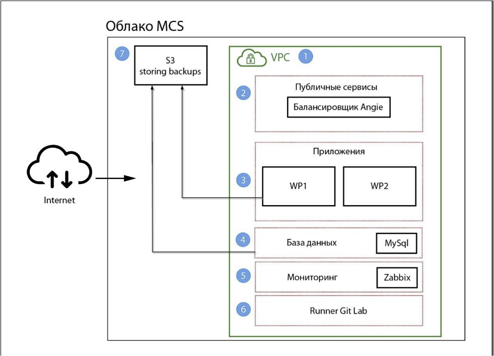

- [Вэб-проект](#Вэб-проект)
  * [Название](#Название)
  * [Подготовка](#Подготовка)
  * [Запуск](#Запуск)
  * [Описание](#Описание)


# Вэб-проект

## Название

Проект развёртывания инфраструктуры для WEB-приложения Wordpress. Реализован с помощью системы управления конфигурациями - Ansible.

## Подготовка

Перед запуском необходимо иметь хост с зарегистрированным в проекте gitlab-runner и запущенным на хосте с установленным Ansible.
У пользователя gitlab-runner с этого хоста должен быть настроен доступ по SSH к рабочим нодам. Для запуска необходимо 5 рабочих нод.
Операционнная система на них должна быть - Ubuntu 20.04LTS.
Ресурсные емкости всех виртуальных машин 1vcpu, 2G vram, 20Gb диск.

Инфраструктура состоит из:

- балансировщик
- два сервера приложений
- сервер баз данных mysql
- сервер мониторинга

 

## Запуск

Для запуска необходимо склонировать репозиторий на локальную машину и открыть директорию с ним: 
```bash
git clone git@gitlab.sager.su:cloudcraft-crew/project_gb.git
cd project_gb/
```

Так же, необходимо заполнить файл с инвентарём, указав необходимые данные для подключения по SSH к рабочим нодам.
Пример:
```bash
all:
  children:
    db:
      hosts:
        wp-1-node:
          ansible_ssh_user: root
          ansible_ssh_host: 192.168.1.121
          ansible_ssh_port: 22
          ansible_ssh_private_key_file: /var/lib/gitlab-runner/.ssh/id_rsa
        wp-2-node:
          ansible_ssh_user: root
          ansible_ssh_host: 192.168.1.122
          ansible_ssh_port: 22
          ansible_ssh_private_key_file: /var/lib/gitlab-runner/.ssh/id_rsa
```

Затем, необходимо открыть конфиг vars/main.yml и установить в нём свои значения во все переменные. Необходимо указать свои логины и пароли заменив дефолтные для запускаемых сервисов.

После этого остаётся только отправить обновление файлов в удалённый репозиторий:
```bash
git push -u origin main
```

## Описание

Описание используемых ролей:

-   ```backup_db```: Настройка бекапа базы данных в S3 bucket. Бекап происходит раз в сутки. Файл с бекапом хранится трое суток.
-   ```backup_wp_1```: Настройка бекапа содержимого сайта на одном из хостов с Wordpress.
-   ```basic_packages```: Установка зависимостей, необходимого ПО.
-   ```conf_agent```: Настройка заббикс агента.
-   ```install-angie```: Установка WEB-сервера angie
-   ```iptables```: Настройка файерволла на рабочих нодах.
-   ```mysql```: Установка и настройка базы данных на основе MySQL
-   ```setup_angie```: Настройка WEB-сервера angie
-   ```ssh_keys```: Настройка подключения по SSH между хостами с Wordpress для синхронизации файлов сайта.
-   ```synch```: Настройка двусторонней синхронизации файлов сайта на хостах с Wordpress
-   ```wp```: Установка и настройка Wordpress
-   ```zabbix```: Утсановка и настройка сервера мониторинга zabbix
